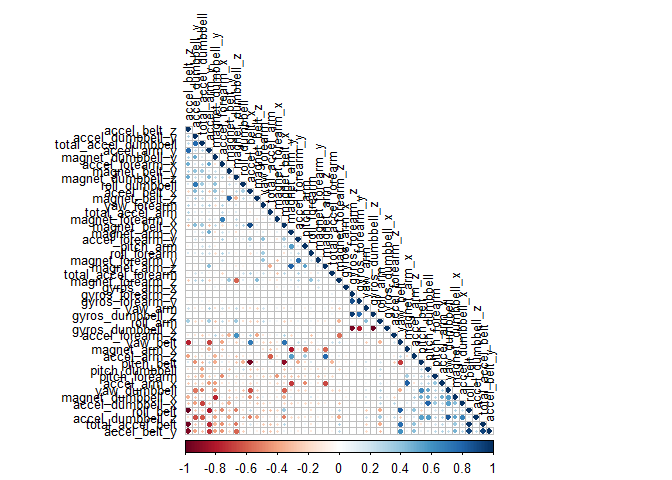
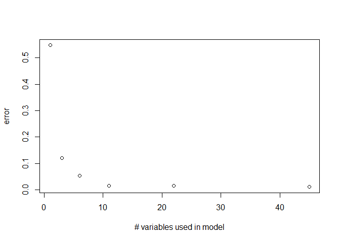
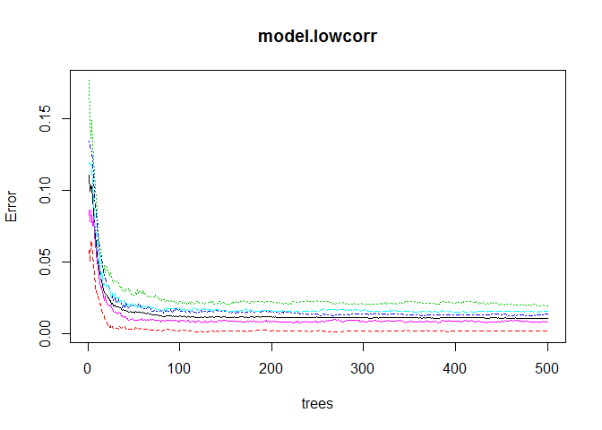
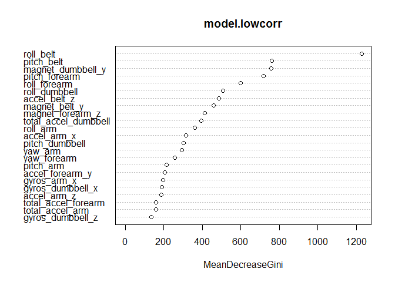

# Practical Machine Learning: Predicting Exercise Quality
Matthias Schmitt  
8 Januar 2017  


## Synopsis

People often quantify how much of an activity they do, but they rarely quantify how well they do it. In this project, we use data from accelerometers on the belt, forearm, arm, and dumbell of 6 participants to predict the manner in which they did the exercise. The data has been used in the following study with the same goals: <http://groupware.les.inf.puc-rio.br/har>. The study setup is available on that page, too.


```r
set.seed(1234)
train.raw <- read.csv(file="pml-training.csv",head=TRUE,sep=",",na.strings= c("NA",""," "))
test.raw <- read.csv(file="pml-testing.csv",head=TRUE,sep=",",na.strings= c("NA",""," "))
```

## Exploration of the dataset

For univariate data exploration we run a summary of the data and observe the following:

* there are a number of variables with overwhelmingly many missings. Also, some variables are statistical summaries of others (the *kurtosis*-variables etc.).
* many variables have very low standard deviation, which makes them less likely to be good predictors


```r
xtable(summary(train.raw))
# output not shown for reason of length.
```

We use these insights to restrict the number of variables and clean the data.

# Data cleaning & transformation

## Treating missing values

There are a number of columns with (almost) only NA in them (statistical summary variables). We remove variables if they contain $> 50\%$ NAs.


```r
naRows <- colSums(is.na(train.raw))
vars.missings <- names(naRows[naRows >= 0.5*dim(train.raw)[1]])

train.base <- train.raw[,setdiff(names(train.raw),vars.missings)]
```

## Checking data quality for prediction purposes

If a variable $x$ has less than $\sigma(x) < 1$, we'll remove it, for such peaky variables have 
little predictive power. To short before the submission deadline I found **nearZeroVar** from the **caret** package, which does the same thing! Last but not least we remove columns obviously unique to each observation 
in the dataset such as timestamps and ID variables (e.g. participant!).


```r
vars.low_sd <- names(train.base[,sapply(train.base, function(x) { sd(x) < 1 })])

## Remove timestamps and ID variables for model training
vars.other <- c("X", "user_name", "raw_timestamp_part_1", "raw_timestamp_part_2", "cvtd_timestamp", "num_window")
```

## Produce final training set


```r
train.final <- train.base[,setdiff(names(train.base),union(vars.low_sd, vars.other))]
```

# Model construction

Given the the large number of variables and data points, we construct a boosting model as a baseline and a random forest as our candidate model for submission. As pointed out in the lecture, most kaggle competitions are won with random forests! First we split our dataset into a train (60%), a train-step validation (40%) and the provided test set:


```r
inTrain <- createDataPartition(y=train.final$classe,p=.6, list=FALSE)
train.trainingset <- train.final[inTrain,]
train.validationset <- train.final[-inTrain,]
test.outofsample <- test.raw
```

## Identify highly correlated variables 

After univariate analysis already kicked out some variables, another concern for variable selection is correlation. While random forests might be quite robust to correlation in the input variables, it is still better to build a slightly simpler model with fewer variables than to use the last bit of covariation of the training data, which might lead to overfitting. 


```r
correlMatrix <- cor(train.trainingset[, -length(train.trainingset)])
corrplot(correlMatrix, order = "FPC", method = "circle", type = "lower", tl.cex = 0.8,  tl.col = rgb(0, 0, 0))
```

<!-- -->

We exclude one of a pair of variables $(x_1, x_2)$ if their correlation $\rho(x_1,x_2) > .5$.


```r
## keep only the lower triangle by 
## filling upper with NA
correlMatrix[upper.tri(correlMatrix, diag=TRUE)] <- NA
m <- melt(correlMatrix)
## sort by descending absolute correlation
m <- m[order(- abs(m$value)), ]
## omit the NA values
correlation <- na.omit(m)
## list of highly correlated variables, take first variable of each pair to eliminate
vars.highcorr <- correlation[correlation$value > .5,"Var1"]

vars.final <- setdiff(names(train.trainingset),vars.highcorr)
```


```r
# final variable selection for the training set
train.trainingset.complete <- train.trainingset
train.trainingset.final <- train.trainingset[,vars.final]
```

We can do a sanity check of this reduction in the number of variables by using *rfcv*, which gives us achievable accuracy on a random forest given a subset of the variables in the dataset:


```r
cvresult <- rfcv(train.trainingset.complete[,!names(train.trainingset.complete)=="classe"],   
                 train.trainingset.complete$classe)
plot(names(cvresult$error.cv),  cvresult$error.cv, xlab="# variables used in model", ylab="error")
```

<!-- -->

Not much is happening after $> 20$ best-predicting variables are employed in a model.

## Fit a model

We establish a baseline accuracy by using gradient boosting.


```r
model.gbm.lowcorr <- train(classe ~ ., data = train.trainingset, method="gbm")
```

```r
confusionMatrix(train.validationset$classe, predict(model.gbm.lowcorr, train.validationset))
```

```
## Confusion Matrix and Statistics
## 
##           Reference
## Prediction    A    B    C    D    E
##          A 2202   18    5    5    2
##          B   49 1424   40    2    3
##          C    0   52 1292   20    4
##          D    0    5   43 1232    6
##          E    2   33   16   17 1374
## 
## Overall Statistics
##                                           
##                Accuracy : 0.959           
##                  95% CI : (0.9543, 0.9632)
##     No Information Rate : 0.2872          
##     P-Value [Acc > NIR] : < 2.2e-16       
##                                           
##                   Kappa : 0.9481          
##  Mcnemar's Test P-Value : 1.138e-11       
## 
## Statistics by Class:
## 
##                      Class: A Class: B Class: C Class: D Class: E
## Sensitivity            0.9774   0.9295   0.9255   0.9655   0.9892
## Specificity            0.9946   0.9851   0.9882   0.9918   0.9895
## Pos Pred Value         0.9866   0.9381   0.9444   0.9580   0.9528
## Neg Pred Value         0.9909   0.9829   0.9839   0.9933   0.9977
## Prevalence             0.2872   0.1953   0.1779   0.1626   0.1770
## Detection Rate         0.2807   0.1815   0.1647   0.1570   0.1751
## Detection Prevalence   0.2845   0.1935   0.1744   0.1639   0.1838
## Balanced Accuracy      0.9860   0.9573   0.9569   0.9786   0.9893
```

Classes B/C seem especially hard to match (sometimes as low as only 88% sensitivity, depending on the run). Let''s see if random forest can do better.


```r
model.lowcorr <- randomForest(classe ~ ., data = train.trainingset.final, keep.inbag=TRUE, keep.forest = TRUE)
```

Again we validate the model using the remaining data of the training set:


```r
predict.crossval.lowcorr <- predict(model.lowcorr, train.validationset)
confusionMatrix(train.validationset$classe, predict.crossval.lowcorr)  
```

```
## Confusion Matrix and Statistics
## 
##           Reference
## Prediction    A    B    C    D    E
##          A 2232    0    0    0    0
##          B   13 1496    9    0    0
##          C    1   14 1349    4    0
##          D    0    0   21 1263    2
##          E    0    0    8    6 1428
## 
## Overall Statistics
##                                           
##                Accuracy : 0.9901          
##                  95% CI : (0.9876, 0.9921)
##     No Information Rate : 0.2863          
##     P-Value [Acc > NIR] : < 2.2e-16       
##                                           
##                   Kappa : 0.9874          
##  Mcnemar's Test P-Value : NA              
## 
## Statistics by Class:
## 
##                      Class: A Class: B Class: C Class: D Class: E
## Sensitivity            0.9938   0.9907   0.9726   0.9921   0.9986
## Specificity            1.0000   0.9965   0.9971   0.9965   0.9978
## Pos Pred Value         1.0000   0.9855   0.9861   0.9821   0.9903
## Neg Pred Value         0.9975   0.9978   0.9941   0.9985   0.9997
## Prevalence             0.2863   0.1925   0.1768   0.1622   0.1823
## Detection Rate         0.2845   0.1907   0.1719   0.1610   0.1820
## Detection Prevalence   0.2845   0.1935   0.1744   0.1639   0.1838
## Balanced Accuracy      0.9969   0.9936   0.9848   0.9943   0.9982
```

Indeed, now class C reaches satisfactory sensitivity as well.

# Explore the model 

We are curious to see what variables actually define the model. The importance plot shows that *roll belt* is by far the most important variable, in step with the output of *rfcv* above. We have an expected test set error of 1% for this part of the training set (OOB); this value should get better once we use the entire training set.


```r
print(model.lowcorr)
```

```
## 
## Call:
##  randomForest(formula = classe ~ ., data = train.trainingset.final,      keep.inbag = TRUE, keep.forest = TRUE) 
##                Type of random forest: classification
##                      Number of trees: 500
## No. of variables tried at each split: 4
## 
##         OOB estimate of  error rate: 1.09%
## Confusion matrix:
##      A    B    C    D    E class.error
## A 3341    7    0    0    0 0.002090800
## B   21 2234   22    2    0 0.019745502
## C    2   18 2026    8    0 0.013631938
## D    0    0   29 1900    1 0.015544041
## E    0    2    3   13 2147 0.008314088
```

```r
plot(model.lowcorr)
```

<!-- -->

```r
varImpPlot(model.lowcorr,type=2)
```

<!-- -->

What's interesting about the importance plot is that variable importance falls almost exponentially - again a sign that our cut-off at 24 variables should not have too much of an impact while simplifying the model. The output of *partialPlot* - the ''*partial derivative*'' of the model to some variable - reveals no interesting or interpretable insights, and is therefore skipped here. 

# Model validation - run on testcases

We re-train the model on the entire training set before we apply the model to the final out-of-sample test set.


```r
model.final <- randomForest(classe ~ ., data = train.final[,vars.final], keep.inbag=TRUE, keep.forest = TRUE)
```


```r
predict.test.result <- predict(model.final, test.outofsample)
print(predict.test.result)
```

```
##  1  2  3  4  5  6  7  8  9 10 11 12 13 14 15 16 17 18 19 20 
##  B  A  B  A  A  E  D  B  A  A  B  C  B  A  E  E  A  B  B  B 
## Levels: A B C D E
```


